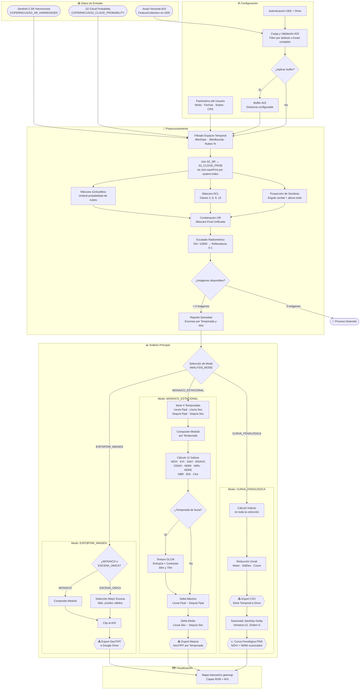

# 🛰️ Procesamiento Avanzado de Sentinel-2 para Bosque Seco Tropical (Bs-T)


---

## ⚠️ Aviso Importante — Estado del Proyecto

> ⚠️ **AVISO:** Este repositorio y sus scripts se encuentran actualmente en **fase de validación técnica, calibración y ajuste**. No se garantiza su estabilidad para entornos de producción. Los resultados generados deben ser verificados de forma independiente antes de su uso en la toma de decisiones.
>
> **Versión:** `1.0.0-validation` · **Última actualización:** Abril 2026

---

## 📖 Descripción

Script multimodal para el procesamiento de imágenes **Sentinel-2 Level-2A (Surface Reflectance, Harmonized)** como insumo de apoyo para la interpretación y análisis de cobertura vegetal en ecosistemas de **Bosque Seco Tropical (Bs-T)** en el municipio de **San Juan Nepomuceno, Bolívar, Colombia**, como parte del proceso de actualización de cobertura de la tierra para el **Predio Santa Helena** de la **Fundación Proyecto Tití**, ejecutado por la **Fundación Ecosistemas Secos de Colombia (FESC)**.

### Problema que resuelve

El monitoreo del Bosque Seco Tropical requiere una aproximación espectral multivariada que considere la marcada estacionalidad fenológica del ecosistema (deciduidad completa en sequía) y la alta nubosidad del Caribe colombiano. Este script aborda ambos retos mediante:

- **Enmascaramiento de nubes de máxima precisión** (triple método: s2cloudless + SCL + proyección geométrica de sombras)
- **Suite de 11 índices espectrales** diseñados para discriminar coberturas en Bs-T
- **Análisis estacional bimodal** con deltas fenológicos entre temporadas
- **Composiciones Medoid** que evitan píxeles espectralmente sintéticos

### Modos de análisis disponibles

| Modo | Descripción | Producto |
|---|---|---|
| `EXPORTAR_IMAGEN` | Escena única (mejor cobertura) o mosaico Medoid | GeoTIFF multibanda a Google Drive |
| `MOSAICO_ESTACIONAL` | 4 composiciones bimodales + 11 índices + textura GLCM + deltas | Múltiples GeoTIFF por temporada |
| `CURVA_FENOLÓGICA` | Series de tiempo de índices con estadísticas zonales | CSV + gráfica suavizada (Savitzky-Golay) |

---

## ⚙️ Prerrequisitos

1. **Cuenta de Google Earth Engine** autenticada y con acceso aprobado ([signup.earthengine.google.com](https://signup.earthengine.google.com/))
2. **Proyecto de Google Cloud Platform (GCP)** con la API de Earth Engine habilitada
3. **Google Colab** (entorno de ejecución recomendado)
4. **Google Drive** montado para almacenamiento de resultados
5. **Asset vectorial en GEE** con la geometría del área de interés (AOI)

### Librerías requeridas

| Librería | Versión mínima | Propósito |
|---|---|---|
| `earthengine-api` | ≥ 0.1.384 | API de Google Earth Engine |
| `geemap` | ≥ 0.31.0 | Visualización interactiva de mapas GEE |
| `rasterio` | ≥ 1.3.0 | Lectura/escritura de datos raster |
| `geopandas` | ≥ 0.14.0 | Manejo de datos vectoriales |
| `scipy` | ≥ 1.11.0 | Filtro Savitzky-Golay para suavizado |
| `matplotlib` | ≥ 3.8.0 | Generación de gráficas fenológicas |
| `pandas` | ≥ 2.1.0 | Manipulación de datos tabulares |
| `numpy` | ≥ 1.26.0 | Cálculo numérico |

> 💡 Las librerías se instalan automáticamente al ejecutar la Sección 1 del script.

---

## 🚀 Instrucciones de Uso

### Paso 1: Abrir en Google Colab
Sube el notebook a Google Colab o clona este repositorio y abre el script desde tu Drive.

### Paso 2: Configurar credenciales
Edita la **Sección 3** del script y reemplaza `YOUR_GCP_PROJECT_ID` con el ID de tu proyecto de Google Cloud Platform:
```python
PROJECT_ID = 'tu_id_de_proyecto_gcp'
```

### Paso 3: Configurar el Asset del AOI
En la **Sección 4.5**, reemplaza la ruta del asset con tu propio asset vectorial en GEE:
```python
RUTA_ASSET_AOI = 'projects/tu_proyecto/assets/tu_asset'
```

### Paso 4: Seleccionar modo de análisis
En la **Sección 4.2**, elige el modo deseado:
```python
ANALYSIS_MODE = 'EXPORTAR_IMAGEN'  # o 'MOSAICO_ESTACIONAL' o 'CURVA_FENOLÓGICA'
```

### Paso 5: Ejecutar secuencialmente
Ejecuta todas las celdas en orden secuencial (Sección 1 → 10). Las tareas de exportación se envían a GEE en segundo plano y pueden monitorearse en la pestaña **Tasks** de la consola de GEE.

---

## 🗺️ Entradas y Salidas

### Inputs

| Tipo | Fuente | Detalle |
|---|---|---|
| Imágenes satelitales | `COPERNICUS/S2_SR_HARMONIZED` | Sentinel-2 Level-2A Surface Reflectance |
| Probabilidad de nubes | `COPERNICUS/S2_CLOUD_PROBABILITY` | Dataset s2cloudless |
| Área de interés (AOI) | Asset vectorial en GEE | FeatureCollection (shapefile cargado como asset) |
| Rango temporal | Configurable | Por defecto: 2025-01-01 a 2026-04-15 |

### Outputs

| Producto | Formato | Destino |
|---|---|---|
| Mosaico / Escena única | GeoTIFF (bandas RGB + NIR) | Google Drive (`Fund_Titi/`) |
| Mosaicos estacionales | GeoTIFF multibanda (índices + textura) | Google Drive (`Fund_Titi/`) |
| Imágenes Delta | GeoTIFF (ΔSAVI, ΔMSAVI2, ΔNDMI, etc.) | Google Drive (`Fund_Titi/`) |
| Serie temporal | CSV con estadísticas zonales | Google Drive (`Fund_Titi/`) |
| Curva fenológica | PNG (gráfica NDVI/NDMI suavizada) | Google Drive (`Fund_Titi/`) |
| CRS de exportación | MAGNA-SIRGAS 2018 / Origen Nacional (EPSG:9377) | Configurable |

---

## 📐 Diagrama de Flujo del Pipeline



---

## 📚 Fuentes de Datos y Citación

### Sentinel-2 Level-2A Surface Reflectance (Harmonized)

| Atributo | Detalle |
|---|---|
| **Producto** | Sentinel-2 MSI Level-2A Surface Reflectance Harmonized |
| **Identificador GEE** | `COPERNICUS/S2_SR_HARMONIZED` |
| **Proveedor** | Agencia Espacial Europea (ESA) / Copernicus |
| **Resolución espacial** | 10m (B2-B4, B8), 20m (B5-B7, B11-B12), 60m (B1, B9-B10) |
| **Resolución temporal** | ~5 días (constelación A+B) |
| **Catálogo GEE** | [developers.google.com/earth-engine/datasets/catalog/COPERNICUS_S2_SR_HARMONIZED](https://developers.google.com/earth-engine/datasets/catalog/COPERNICUS_S2_SR_HARMONIZED) |

> **Cita:** Main-Knorn, M., Pflug, B., Louis, J., Debaecker, V., Müller-Wilm, U., & Gascon, F. (2017). Sen2Cor for Sentinel-2. *Proc. SPIE 10427, Image and Signal Processing for Remote Sensing XXIII*, 1042704.

### S2 Cloud Probability (s2cloudless)

| Atributo | Detalle |
|---|---|
| **Producto** | Sentinel-2 Cloud Probability |
| **Identificador GEE** | `COPERNICUS/S2_CLOUD_PROBABILITY` |
| **Proveedor** | Sinergise / Sentinel Hub |
| **Catálogo GEE** | [developers.google.com/earth-engine/datasets/catalog/COPERNICUS_S2_CLOUD_PROBABILITY](https://developers.google.com/earth-engine/datasets/catalog/COPERNICUS_S2_CLOUD_PROBABILITY) |

> **Cita:** Zupanc, A. (2017). Improving Cloud Detection with Machine Learning. *Sentinel Hub Blog*.

---

## 🔄 Limitaciones Conocidas y Trabajo Futuro

### Limitaciones técnicas identificadas

1. **Enmascaramiento agresivo en bordes costeros:** La combinación de NIR_DARK_THRESHOLD con s2cloudless puede enmascarar erróneamente cuerpos de agua poco profundos o manglares en condiciones de baja reflectancia NIR.
2. **Altura de base de nubes fija (2000 m):** La proyección de sombras asume una altura constante de 2000 m para nubes convectivas. Esta aproximación puede ser imprecisa para nubes estratiformes bajas o para cumulonimbus de gran desarrollo vertical.
3. **Textura GLCM sin normalización min-max:** El escalado de NIR a enteros (0-255) mediante multiplicación directa (`×255`) no garantiza el uso completo del rango dinámico, lo que puede afectar la comparabilidad inter-temporal de las métricas de textura.
4. **Regularización temporal en Curva Fenológica:** El resampling a 15 días puede suavizar excesivamente variaciones fenológicas rápidas (ej. respuesta a eventos de lluvia aislados).
5. **Dependencia de Google Colab:** El script está diseñado para ejecutarse en Google Colab. La ejecución local requiere adaptación del montaje de Drive y la autenticación.
6. **Proyección EPSG:9377 por WKT:** GEE no reconoce nativamente el código EPSG:9377, lo que obliga a definirlo mediante WKT. Esto puede generar incompatibilidades menores con software SIG que no soporte WKT extenso.

### Trabajo futuro

- [ ] Validación cruzada con datos de campo (parcelas de monitoreo del Predio Santa Helena)
- [ ] Implementación de clasificación supervisada de coberturas CLC Colombia con los productos generados
- [ ] Calibración del umbral NIR_DARK_THRESHOLD específico para la región del Caribe colombiano
- [ ] Integración de bandas SAR (Sentinel-1) para complementar la discriminación en periodos de alta nubosidad
- [ ] Automatización del pipeline con ejecución programada (Google Cloud Scheduler + Earth Engine)

---

## ⚖️ Licencia

Este proyecto está licenciado bajo la **MIT License**. Consulte el archivo [LICENSE](LICENSE) para más detalles.

---

## 🤝 Atribución de Asistencia IA

La documentación técnica de este script (docstrings, comentarios de flujo, README y diagrama de flujo) fue generada con asistencia del modelo de IA **Gemini** (Google DeepMind). La responsabilidad técnica y científica de la lógica espacial, los parámetros ecológicos, las decisiones metodológicas y la validación de resultados recae exclusivamente en el autor humano.

---

## 📁 Estructura del Repositorio

```
📦 gee-s2-dryforest-phenology-toolkit/
├── 📂 notebooks/               # Script principal (.py / .ipynb)
│   └── 📄 gee_s2_dryforest_phenology_toolkit.py
├── 📂 docs/                    # Documentación adicional
├── 📂 outputs/                 # Resultados de ejemplo (opcional)
├── 📄 README.md                # Este archivo
├── 📄 requirements.txt         # Dependencias Python
└── 📄 LICENSE                  # Licencia del proyecto
```
